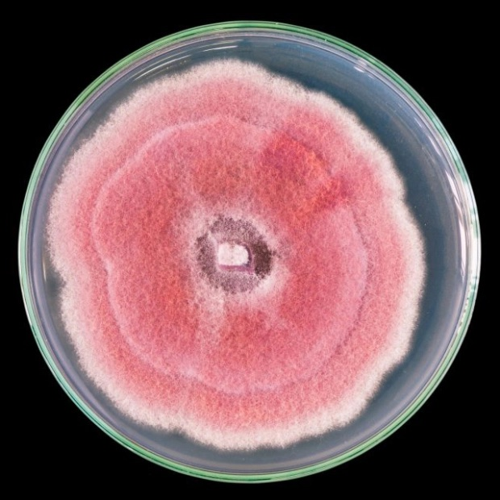
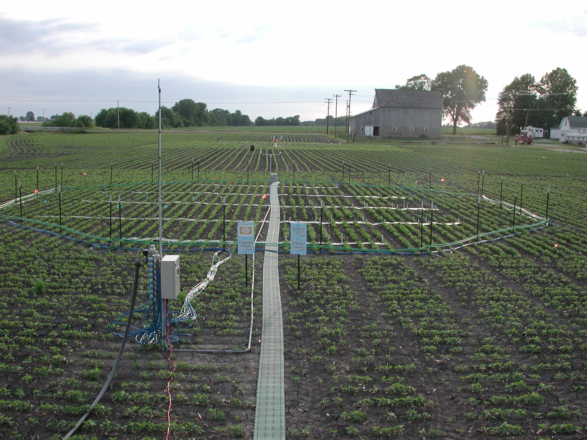

My interests lie in understanding how communities will respond to anthropogenic global change. I find species interactions to be fascinating and there’s still so much we do not know about the mechanisms that allow for many interactions to co-exist! I focus on positive-positive interactions (mutualisms) because of their role in so many key ecosystem processes and services. For example, the vast majority of flowering plants require pollination by animals, yet how do these systems support such diversity of pollinators all sharing common resources (pollen and nectar)? Similarly, nearly all plants on land engage in a complex web of underground mutualisms with microbes that supply water and nutrients to their partners. How will these interactions fare in a changing planet? How will the shifts in these interactions feedback into ecosystem responses?

<aside>
  <figure>
    
    
    
    <figcaption> Diverse communities of microbes live within plants. This fungus was cultivated from a leaf and is a part of its microbiome.
    </figcaption>
  </figure>
  </aside>

I am a community ecologist trained to ask and test empirical and theoretical questions. Using manipulative experiments and modeling, I attempt to test mechanisms underpinning the dynamics of multi-species interactions. Ultimately, my research helps to address the complexities of incorporating species interactions into predictive models, especially species conservation models related to human induced climate change.

  
# Current Research

### Plant-fungal networks under global change

One arm of my research program focuses on understanding the effects of *elevated CO~2~ and CO~2~ on plant-fungal interactions within the soybean microbiome*. We are working with other research groups at the [USDA SoyFACE facility](https://soyface.illinois.edu/) to test how microbiomes change under increased CO~2~ fumigation which mimics projected atmospheric change in the region. Given that microbiomes are increasingly seen as extended phenotypes of their hosts, it's important to guage how these microbial players will be affected by global change. Our research builds fungal networks and survey changes to microbial community composition as a result of elevated CO~2~. Many fungal interactions are likely sensitive to climate change given the nature of resource-based mutualisms.

<aside>
 <figure>
    
    
    
    <figcaption> SoyFACE Illinois
    </figcaption>
  </figure>
</aside>

We  also are testing how the novel climate mitigation strategy of [*rock weathering*](https://doi.org/10.1038/s41586-020-2448-9) may additionally impact plant-fungal interactions. Increasingly  used in agriculutral settings across the globe, rock weathering is a carbon dioxide removal technique where crushed rock is added to fields. This is actually an ancient fertilization practice repurposed for climate mitigation! Here again, fungal interactions may be key in assesing the efficacy of this strategy given that the rates at which weathering occurs (and thus the amount of carbon that can be sequestrated) depends on fungal mining of these rock surfaces. Our research will build fungal networks within plots with full factorial treatment combinations of elevated CO~2~ and basalt rock addition. 

### Cover crops and fungal networks

Understanding how cover crop rotations impact plant-fungal networks

### Synthetic Networks

As a community ecologist I am interested in how multiple species drive ecosystem responses. These are inherently difficult questions to tackle. If we take observational / field based approaches we often lack the ability to derive understanding about mechanisms. This makes ecology especially hard to generalize or predict. 

One approach that I use in my research is sythetic ecology. Here, I am experimentally creating synthetic networks of plants and fungi in laboratory settings. I am using cover crop species and arbuscular mycorrhizal fungi (AMF) as my model community.

# Ongoing Research

My PhD research focused on plant-pollinator mutualisms. I continue to lead projects:

* [Experimentally testing shifts in phenology mismatch between plants and their pollinators](https://www.brosilab.org/ecological-networks/#toggle-id-2)

* Understanding how species losses from plant-pollinator networks affect network stability and structure as a whole

*Understanding how network models of plant-pollinators can account for more biological realism such as niche dynamics driven by competitive relationships within guilds.

*[Testing niche breadth plasticity of species interactions under perturbation](https://github.com/connor-morozumi/drought-plant-pol-niche) 

