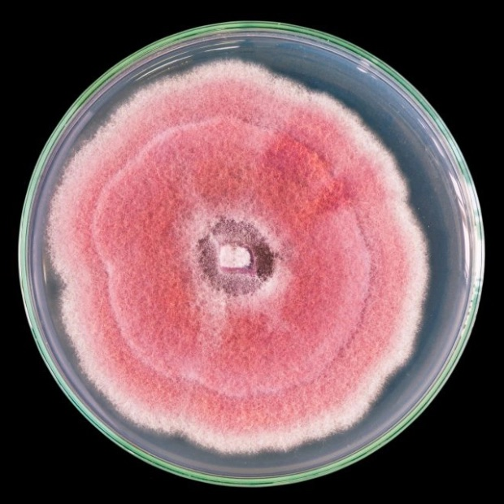
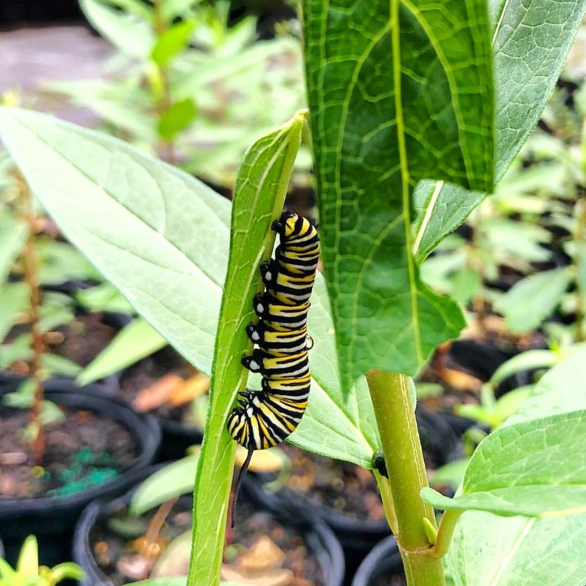

My goals as an educator in the sciences are threefold. (1) I intend to increase student commitment to learning by implementing evidence-based research regarding best teaching practices. My teaching philosophy is grounded in the idea that students learn better when they are active participants in their learning of science. (2) my philosophy of learning-by-doing extends to students learning about the practice of science. I aim for students of diverse backgrounds to see a future in the sciences and believe my teaching of how science is conducted are strongly linked to these outcomes. (3) I strive for my students and mentees to gain independence in asking ecological questions grounded in primary source knowledge.

I have developed several courses at the undergraduate and graduate level.

# Fungal Ecology Lab CURE

Students researched fungal microbes and learned how to ask ecological questions about their communities. Students learned microbiology lab techniques necessary for culturing and analyzing microbial communities. Students proposed a testable ecological question and carried out the experiment. Students practiced  aspects of the scientific process, including presenting results to other scientists and the public.

<aside>
<figure>
    
  </figure>
</aside>

<aside>
<figure>
    
  </figure>
</aside>

# Data Analysis for Population Biology, Ecology, and Evolution

Students learned relevant statistical tools essential for answering population biology, ecology, and evolution related questions. Topics included experimental design and statistical tool selection, data summarization and visualization. I taught the course in the statistical programming language ‘R’

# Teaching & Mentoring Resources

I like to have these close at hand when developing new courses or thinking about how to improve my mentorship.

## Inclusive teaching and pedagogy

### [Inclusive STEM Teaching Project](https://www.inclusivestemteaching.org/)

This is an amazing 6-week course that is completely free. It is administered as a MOOC (massive open online course). Learn from educators and researchers who study empirically supported best practices for improving inclusion in all aspects of teaching. This course should be mandatory for all STEM educators in my opinion!

### [Universal Design Principles](http://udlguidelines.cast.org/)

The folks at Center for Applied Special Technology (CAST) have put together an awe inspiring resource on how to apply Universal Design (UD) principles for teaching. When we think about improving our teaching to maximize **multiple means of engagement, representation, and action/expression** we provide access to knowledge for all learners. Find excellent suggestions backed by empirical research. Topics range from increasing student independence / saliency of goals and objectives to varying modes of communication.

## Evidence based teaching
[CourseSource](https://www.coursesource.org/)

Page through an open-access and peer-reviewed journal of teaching materials at CourseSource.

## Mentorship
[National Research Mentoring Network](https://nrmnet.net/)

A wealth of trainings and information for mentoring students in research. These have been tailored for career stage (undergraduate through administrator) and cover topics like unconscious bias training, grant writing, and much more.

